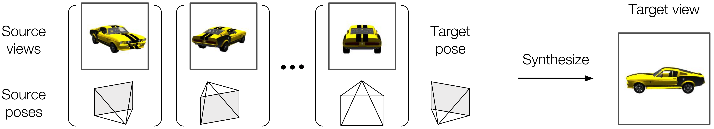
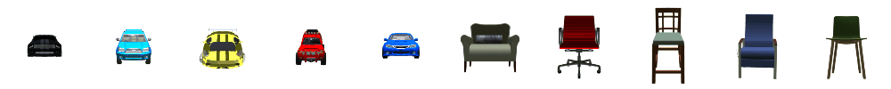
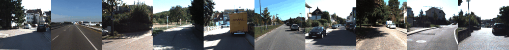
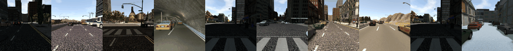
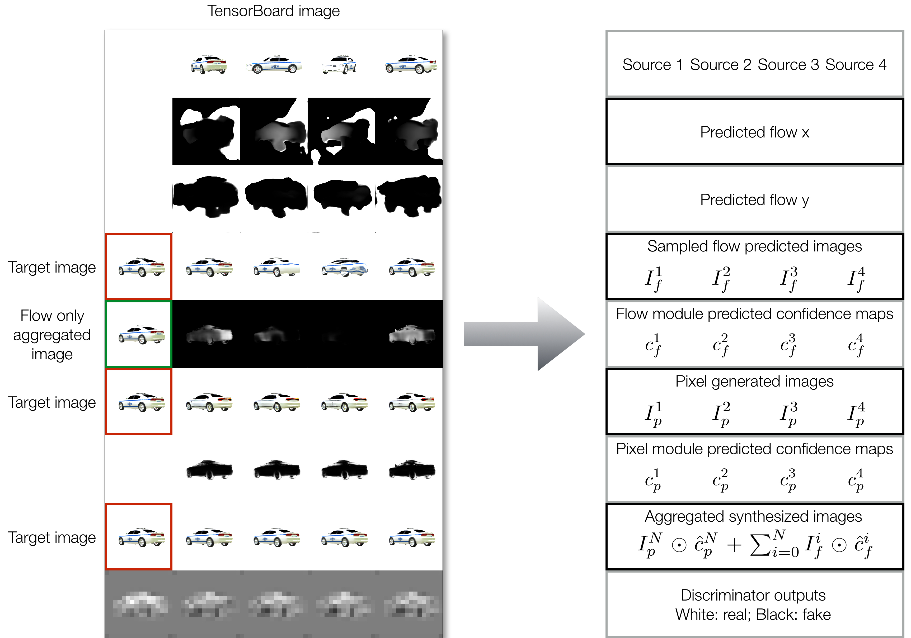

[](https://paperswithcode.com/sota/novel-view-synthesis-kitti-novel-view?p=multi-view-to-novel-view-synthesizing-novel-1)
[](https://paperswithcode.com/sota/novel-view-synthesis-shapenet-car?p=multi-view-to-novel-view-synthesizing-novel-1)
[](https://paperswithcode.com/sota/novel-view-synthesis-shapenet-chair?p=multi-view-to-novel-view-synthesizing-novel-1)
[](https://paperswithcode.com/sota/novel-view-synthesis-synthia-novel-view?p=multi-view-to-novel-view-synthesizing-novel-1)

# Multi-view to Novel view: <br/>Synthesizing Novel Views with Self-Learned Confidence 

## Descriptions
This project is a TensorFlow implementation of [**Multi-view to Novel view: Synthesizing Novel Views with Self-Learned Confidence**](https://shaohua0116.github.io/Multiview2Novelview/), which is published in [ECCV 2018](https://eccv2018.org/). We provide codes, [datasets](https://github.com/shaohua0116/Multiview2Novelview#datasets), and [checkpoints](https://github.com/shaohua0116/Multiview2Novelview#checkpoints). 

In this work, we address the task of **multi-view novel view synthesis**, where we are interested in synthesizing a target image with an arbitrary camera pose from given source images. An illustration of the task is as follows.

<p align="center">
    
</p>

We propose an end-to-end trainable framework that learns to exploit multiple viewpoints to synthesize a novel view without any 3D supervision. Specifically, our model consists of a **flow prediction module** (*flow predictor)* and a **pixel generation module** (*recurrent pixel generator*) to directly leverage information presented in source views as well as hallucinate missing pixels from statistical priors. To merge the predictions produced by the two modules given multi-view source images, we introduce a **self-learned confidence aggregation mechanism**. An illustration of the proposed framework is as follows.

<p align="center">
    
</p>

We evaluate our model on images rendered from 3D object models ([ShapeNet](https://www.shapenet.org/)) as well as real and synthesized scenes ([KITTI](http://www.cvlibs.net/datasets/kitti/) and [Synthia](http://synthia-dataset.net/)). We demonstrate that our model is able to achieve state-of-the-art results as well as progressively improve its predictions when more source images are available.

A simpler novel view synthesis codebase can be found at [**Novel View Synthesis in TensorFlow**](https://github.com/shaohua0116/NovelViewSynthesis-TensorFlow), where all the data loaders, as well as training/testing scripts, are well-configured, and you can just play with models.

## Prerequisites

- Python 2.7
- [Tensorflow 1.3.0](https://github.com/tensorflow/tensorflow/tree/r1.0)
- [NumPy](http://www.numpy.org/)
- [colorlog](https://pypi.python.org/pypi/colorlog)
- [h5py](http://docs.h5py.org/en/latest/build.html#install)
- [imageio](https://pypi.org/project/imageio/)
- [six](https://pypi.org/project/six/)

## Datasets

All datasets are stored as HDF5 files, and the links are as follows. Each data point (HDF5 group) contains an image and its camera pose.

### ShapeNet
<p align="center">
    
</p>

- Download from
    - [car](https://drive.google.com/open?id=1vrZURHH5irKrxPFuw6e9mZ3wh2RqzFC9) (150GB) 
    - [chair](https://drive.google.com/open?id=1-IbmdJqi37JozGuDJ42IzOFG_ZNAksni) (14GB) 
- Put the file to this directory `./datasets/shapenet`.

### KITTI
<p align="center">
    
</p>

- Download from [here](https://drive.google.com/open?id=1LT3WoHxdCycu4jTxCGc1vGYpdRWridFH) (4.3GB) 
- Put the file to this directory `./datasets/kitti`.

### Synthia
<p align="center">
    
</p>

- Download from [here](https://drive.google.com/open?id=1Fxv5r7oeG0PHgR42S5pHNvyl2pJN739H) (3.3GB) 
- Put the file to this directory `./datasets/synthia`.

## Usage
After downloading the datasets, we can start to train models with the following command:

### Train
```bash
$ python trainer.py  --batch_size 8 --dataset car --num_input 4
```
- Selected arguments (see the `trainer.py` for more details)
    - --prefix: a nickname for the training
    - --dataset: choose among `car`, `chair`, `kitti`, and `synthia`. You can also add your own datasets.
    - Checkpoints: specify the path to a pre-trained checkpoint
        - --checkpoint: load all the parameters including the flow and pixel modules and the discriminator.
    - Logging
        - --log\_setp: the frequency of outputing log info (`[train step  681] Loss: 0.51319 (1.896 sec/batch, 16.878 instances/sec)`)
        - --ckpt\_save\_step: the frequency of saving a checkpoint
        - --test\_sample\_step: the frequency of performing testing inference during training (default 100)
        - --write\_summary\_step: the frequency of writing TensorBoard summaries (default 100)
    - Hyperparameters
        - --num\_input: the number of source images
        - --batch\_size: the mini-batch size (default 8)
        - --max\_steps: the max training iterations
    - GAN
        - --gan\_type: the type of GAN losses such as LS-GAN, WGAN, etc

### Interpret TensorBoard
Launch Tensorboard and go to the specified port, you can see differernt losses in the **scalars** tab and plotted images in the **images** tab. The plotted images could be interpreted as follows.

<p align="center">
    
</p>

### Test
We can also evaluate trained models or the checkpoints provided by the authors with the following command:
```bash
$ python evaler.py --dataset car --data_id_list ./testing_tuple_lists/id_car_random_elevation.txt [--train_dir /path/to/the/training/dir/ OR --checkpoint /path/to/the/trained/model] --loss True --write_summary True --summary_file log_car.txt --plot_image True --output_dir img_car
```
- Selected arguments (see the `evaler.py` for more details)
    - Id list
        - --data_id_list: specify a list of data point that you want to evaluate
    - Task
        - --loss: report the loss
        - --write_summary: write the summary of this evaluation as a text file
        - --plot_image: render synthesized images
    - Output
        - --quiet: only display the final report
        - --summary_file: the path to the summary file
        - --output_dir: the output dir of plotted images

## Result

### ShapeNet Cars
<p align="center">
    
</p>

[More results](https://shaohua0116.github.io/Multiview2Novelview/results/car_sampled/car_results_1k.html) for ShapeNet cars (1k randomly samlped results from all 10k testing data)

### ShapeNet Chairs
<p align="center">
    
</p>

[More results](https://shaohua0116.github.io/Multiview2Novelview/results/car_sampled/car_results_1k.html) for ShapeNet cars (1k randomly samlped results from all 10k testing data)

### Scenes: KITTI and Synthia
<p align="center">
    
</p>

## Checkpoints
We provide checkpoints and evaluation report files of our models for all eooxperiments.
- [ShapeNet Cars](https://drive.google.com/drive/folders/1speUFwZsKBbXTmuD-vvckkYsbbakTU0E?usp=sharing)
- [ShapeNet Chairs](https://drive.google.com/drive/folders/1M7jZxWd91BiiqP9KchAvkMy_jdeVjoeO?usp=sharing)
- [KITTI](https://drive.google.com/drive/folders/1hg9J1PAj2shICEra7IWRTjl3Ud4D9aX7?usp=sharing)
- [Synthia](https://drive.google.com/drive/folders/1AuU0DP8IqrOfRQlooimuvorM2g1QM2Iz?usp=sharing)

## Related work
- \[L_1\] [Multi-view 3D Models from Single Images with a Convolutional Network](https://arxiv.org/abs/1511.06702) in CVPR 2016
- \[Appearance Flow\][View Synthesis by Appearance Flow](https://arxiv.org/abs/1605.03557) in ECCV 2016
- \[TVSN\] [Transformation-Grounded Image Generation Network for Novel 3D View Synthesis](https://arxiv.org/abs/1703.02921) in CVPR 2017
- [Neural scene representation and rendering](http://science.sciencemag.org/content/360/6394/1204) in Science 2018
- [Weakly-supervised Disentangling with Recurrent Transformations for 3D View Synthesis](https://arxiv.org/abs/1601.00706) in NIPS 2015
- [DeepStereo: Learning to Predict New Views From the World's Imagery](https://arxiv.org/abs/1506.06825) in CVPR 2016
- [Learning-Based View Synthesis for Light Field Cameras](http://cseweb.ucsd.edu/~viscomp/projects/LF/papers/SIGASIA16/) in SIGGRAPH Asia 2016

## Cite the paper
If you find this useful, please cite
```
@inproceedings{sun2018multiview,
  title={Multi-view to Novel View: Synthesizing Novel Views with Self-Learned Confidence},
  author={Sun, Shao-Hua and Huh, Minyoung and Liao, Yuan-Hong and Zhang, Ning and Lim, Joseph J},
  booktitle={European Conference on Computer Vision},
  year={2018},
}

```

## Authors
[Shao-Hua Sun](http://shaohua0116.github.io/), [Minyoung Huh](http://minyounghuh.com/), [Yuan-Hong Liao](https://andrewliao11.github.io/), [Ning Zhang](https://people.eecs.berkeley.edu/~nzhang/), and [Joseph J. Lim](http://www-bcf.usc.edu/~limjj/)
